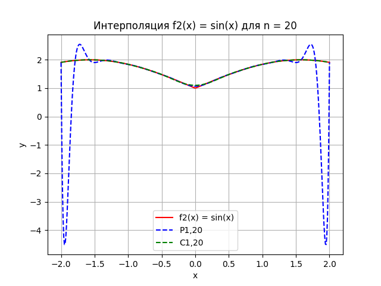

# Интерполяция алгебраическими многочленами

    <h2>Таблица 1: Погрешность интерполяции для функции f1(x)</h2>
    <table>
        <tr>
            <th>n</th>
            <th>max P1,n(xi) · f1(xi)</th>
            <th>max |C1,n(xi) · f1(xi)|</th>
        </tr>
        <tr>
            <td>5</td>
            <td>0.206839</td>
            <td>0.115096</td>
        </tr>
        <tr>
            <td>10</td>
            <td>0.000214557</td>
            <td>2.44931e-05</td>
        </tr>
        <tr>
            <td>15</td>
            <td>2.24397e-07</td>
            <td>5.07736e-09</td>
        </tr>
        <tr>
            <td>20</td>
            <td>3.0449e-12</td>
            <td>7.90479e-14</td>
        </tr>
        <tr>
            <td>30</td>
            <td>2.71008e-11</td>
            <td>7.26086e-14</td>
        </tr>
    </table>

---

    <h2>Таблица 2: Погрешность интерполяции для функции f2(x)</h2>
    <table>
        <tr>
            <th>n</th>
            <th>max |P2,n(xi) · f2(xi)|</th>
            <th>max |C2,n(xi) · f2(xi)|</th>
        </tr>
        <tr>
            <td>5</td>
            <td>0.295622</td>
            <td>0.369878</td>
        </tr>
        <tr>
            <td>10</td>
            <td>1.35049</td>
            <td>0.110249</td>
        </tr>
        <tr>
            <td>15</td>
            <td>1.02825</td>
            <td>0.126451</td>
        </tr>
        <tr>
            <td>20</td>
            <td>191.113</td>
            <td>0.0570876</td>
        </tr>
        <tr>
            <td>30</td>
            <td>63258.5</td>
            <td>0.038569</td>
        </tr>
    </table>

---

## Графики
  
  
  
  
  
  

---

## Общие выводы
1. Интерполяция алгебраическими многочленами для f1(x) показывает высокую точность и сходимость.
2. Для f2(x) наблюдается неустойчивость при увеличении числа узлов, что требует применения альтернативных методов интерполяции (например, сплайнов).
3. Результаты подчеркивают важность выбора метода интерполяции в зависимости от свойств аппроксимируемой функции.
